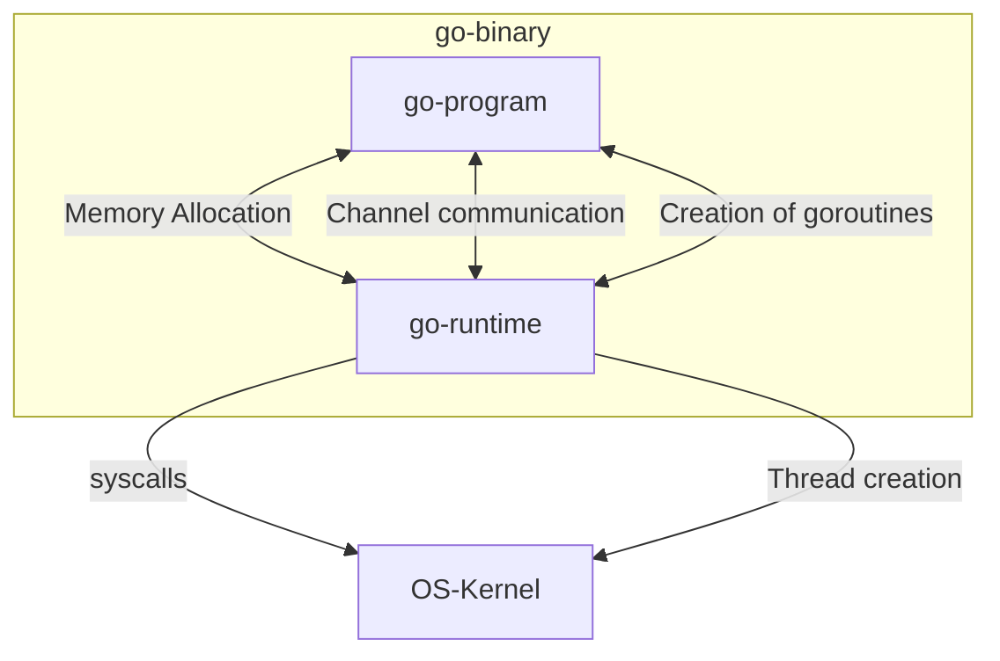
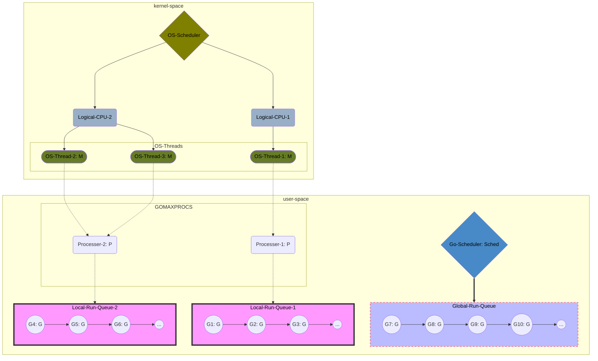

--- 
UID: 202301071523
title: "Golang goroutines-202301071522"
tags:
- articles
- golang
- goroutines
---

# Golang goroutines-202301071522

A note describe how goroutine works

# Notes

## Concurrency is not Parallelism

- Parallelism is doing multiple things at the same time.
- Concurrency is dealing with multiple things at once(does not need to be done at the same time) with some time schedule and parallelism is subset of this.

## What are threads?

## Linux, task, process, thread

[[publish/Linux task, process, thread-202301071513]]

#### What make threads slow?

- Threads have a large stack size (≥ 1MB) therefore consume a lot of memory. So imagine creating 1000s of thread means you already need 1GB of memory. That is a lot!
- Threads need to restore a lot of registers, some of which include AVX( Advanced vector extension), SSE (Streaming SIMD Ext.), Floating Point registers, Program Counter (PC), Stack Pointer (SP) which hurts the application performance.
- Threads setup and teardown requires call to OS for resources (such as memory) which is slow. NOT GOOD!

## What about Goroutines?

 Goroutines exist only in the virtual space of the Go runtime and not the OS, therefore the Go Runtime scheduler is needed to manage their life-cycles.

- **All the OS sees is a single user level process requesting and running multiple threads**

- **The goroutines itself are managed by the Go Runtime Scheduler**

Go Runtime maintains four C structs for this purpose:

- *The G(Goroutines) Struct*
    - Represents a single goroutine
    - Contains the fields necessary to keep track of its stack and current status. 
    - It also contains references to the code that it is responsible.
    
- *The M(OSThread) Struct*
    - Represents a OS thread.
    - Contains points to fields such as the
        - global queue of runnable goroutines
        - the current running goroutine, its own cache and the reference to the scheduler.
    
- *The Sched(Scheduler) Struct*
    - A single, global struct 
    - Keeps track of the
        - different queues of goroutines
        - M's
        - Information that the scheduler needs in order to run, such as the Global Sched Lock.

- *The P(Processor) Struct*
    - Each P has a local Goroutine queue.
    - Each M should be assigned to a P.
    - P may have no Ms if it's blocked or in a system call.

There are two queues contain G Struct:
-  *1 in the runnable queue where M's (threads) can find more work*
- *1 is the free list of goroutines*

**There is only one queue pertaining to M's (threads) that the scheduler maintains. And in order to modify these queues, the Global Sched Lock must be held.**

 - **GOMAXPROCS**:
    - $$Num(P) = GOMAXPROCS$$
     - Go application the number of threads available for Goroutines to run is equal to the GOMAXPROCS,  which by default is equal to the number of cores available for that application.
 - Golang has an NumA:NumB scheduler that also utilizes multiple processors.
     - At any time, NumA goroutines need to be scheduled on NumB OS threads that runs on at most GOMAXPROCS numbers of processors(NumB <= GOMAXPROCS)

### So here is the catch of Goroutines

- A lightweight abstractions over threads
    - The **memory consumption** is better than thread. The creation of goroutines require much lesser memory as compared to threads. It requires 2kb of memory, while threads requires 1MB.
    - **Threads have significant setup and teardown costs** because it has to request resource from the OS and return it once it's done. While Goroutines are created and destroyed by go runtime.
    - **Switch cost**:
        * Threads are scheduled preemptively. If the process is running for more than a scheduler time slice, it would preempt the process and schedule execution of another runnable process on the same CPU, the scheduler needs to save/restore all registers.
*  In Golang, unlike normal functions, the control does not wait for the Goroutine to finish executing. The Control immediately returns to the next line of the code after a Goroutine call

---

# References

- [What are goroutines? And how do they actually work? | by João Henrique Machado Silva | The Polyglot Programmer | Medium](https://medium.com/the-polyglot-programmer/what-are-goroutines-and-how-do-they-actually-work-f2a734f6f991)
- [A complete journey with Goroutines | by Riteek Srivastav | Medium](https://riteeksrivastava.medium.com/a-complete-journey-with-goroutines-8472630c7f5c)
- [Coroutine - Wikipedia](https://en.wikipedia.org/wiki/Coroutine)
- [How Goroutines Work](https://blog.nindalf.com/posts/how-goroutines-work/)
