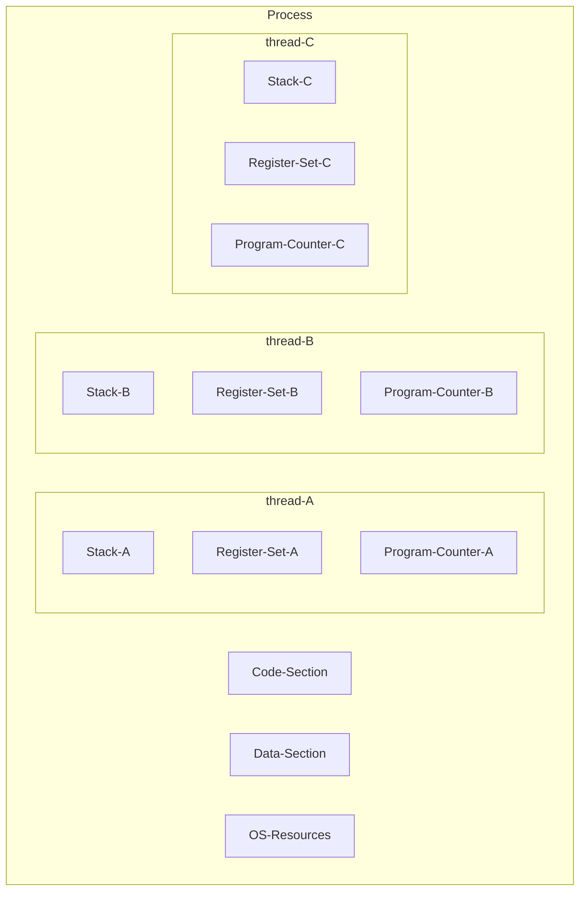
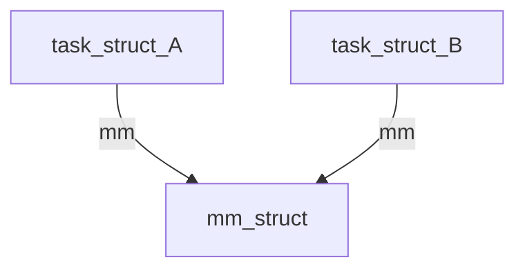

--- 
UID: 202301071514
title: "Linux task, process, thread-202301071513"
tags:
- articles
- linux
- linux-thread
- linux-process
- linux-task
---

# Linux task, process, thread-202301071513

# Summary

Definition of thread, process and task in Linux

# Notes

## Definition of process

Process Includes:

- `Code Section`
- `Data Section`
- `OS Resources (e.g. files)`

$$Code Section+Data Section = Memory$$
$$Memory = (text segment + data segment + heap segment)$$

### `PCB (Process Control Block)`

A PCB is the way how operating system handle process. The PCB is a form created by OS for record the status of process. When switch to different process, the status will be keep in the PCB and recover from the latest status when switch back.

### Process switch called `Context Switch`, when will Context Switch happen?

- External Interrupt ( Emit by components exclude CPU: I/O interrupt、 Timers)
- Internal Interrupt ( Emit by CPU: stack overflow、divided by zero …) 
- Software Interrupt (e.g. System Call: **user mode switch to kernel mode**)

## Definition of thread(Light weight process)

A minimum unit for CPU Scheduling, can not exist alone. Must exist in the process.

A thread includes:

- `Stack`
- `Register Set`
- `Program Counter`

The threads share below resource in a single process:

- `Code Section`
- `Data Section`
- `OS Resources`



A process at least has one thread
A process can have multiple threads

*Process is the object that the OS allocates resources*
*Thread is the object that OS allocates CPU times*

## Kernel-level and user-level thread

*User level thread* is managed by the user-level library to handle `Thread Context Switch`, which only process in user-level so that kernel will never know it exists and never target `System Call`

*Kernel level thread* is managed by OS. The `Thread Context Switch` costs lower that `Process context switch` because it doesn't need `address space`. Specialized for `System Call`

## Inside Linux 

The Linux doesn't have the clearly concept of process and thread; however; the concept inside Linux called `Task`. The `task_struct`, which is also be called `process descriptor`, is the data structure to implement Task.

```c
/* task_struct 記錄著目前這 Process 的狀態 */
/* task_struct 就有一個指向 kernel stack 的變數 stack */
/* task_struct 就有一個指向 mm_struct 的變數 mm_struct */
struct task_struct {
  volatile long state; // -1 unrunnable, 0 runnable, >0 stopped
  void *stack; // point to kernel stack
  struct mm_struct *mm // point to memory descriptor
};
```

If two task share one `mm_struct`, they are called `Thead`



mm_struct is also called `Memory descriptor` which describes the virtual address space for this process.

```c
/* mm_struct 有一個 Process(main thread) 的 user stack 起始位置 */
struct mm_struct {
  unsigned long start_stack // user stack start address
};
```

Inside `mm_struct`, there is a `start_stack`, which is the start address of `user stack`, provides the store space for the processing in the User mode. If it is a Thread, because parent share the `mm_struct`, it will found another space in `heap` or `mmap` for Thread to avoid affect the stack in `mm_struct`.

No matter how to create `user stack`, it will initiate **task_struct->thread->sp** to store the user stack's message.

```c
/* task_struct 就有一個 thread_struct 的變數 */
struct task_struct {
  struct thread_struct thread; // 存放 context switch 相關的資訊
};

/* thread_struct 保留了大部分的 CPU registers 的訊息，context switch 主要就是回復保存在 thread_struct 裡的資訊 */
struct thread_struct {
  unsigned long  sp0; // 存放 kernel stack base address  
  unsigned long  sp;  // 存放 kernel stack (current)top address
};
```

So if we create a process/thread (task_struct), we will get two stacks:

- `user stack`:
    - Build on address space(mm_struct), to use process(mm_struct's stack) or Thread(mm_struct's heap/mmap) in user mode.
- `kernel stack`:
    - Build on kernel address space, use task_struct point to stack(thread_info) in kernel mode.

> `kernel address space`: The memory space share between all  kernel stack
>
> `thread_info`: Inside struct thread_union and relate to context switch


---
# References

[OS Process & Thread (user/kernel) 筆記 | by Yovan | Medium](https://medium.com/@yovan/os-process-thread-user-kernel-%E7%AD%86%E8%A8%98-aa6e04d35002)
