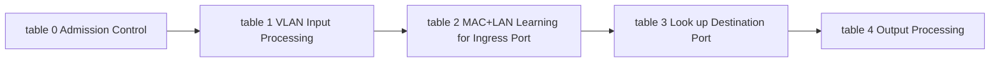

--- 
UID: 202309031731
title: "Open vSwitch Advanced Features Tutorial-202309031730"
tags:
- articles
- OVS
- networking
- OpenFlow
---

# Open vSwitch Advanced Features Tutorial-202309031730

# Summary

The notes for [ovs-advanced.rst](https://github.com/openvswitch/ovs/blob/master/Documentation/tutorials/ovs-advanced.rst) tutorial.

# Terminology

- Open vSwitch
- OpenFlow
	- Flow
	- Table
	- Priority
	- action
	- resubmit
- OVS Actions
	- Load
	- Learn
	- strip_vlan
	- output
- OVS Fields
	- NXM_OF_VLAN_TCI
	- NXM_OF_ETH_DST
	- NXM_OF_ETH_SRC
	- NXM_OF_IN_PORT
	- NXM_OF_NX_REG0
- OVS Register
- Packets
	- reserved multicast protocols
	- IEEE 802.10 Spanning Tree Protocol(STP) 

# Notes

The tutorial shows the example how to use OVS flow table to implement a MAC-learning switch with VLAN trunk and access port.

Below is the overview of the OVS flow tables for this tutorial:

> Consider to understand how OpenFlow flow table works before continue.

The tutorial use 5 tables for pipeline.

![[attachments/ovs-advanced-features-tutorial.png]]

We can turn this pipeline into couple of questions:

1. How to drop packets in flow with?
	1. multicast source address
	2. reserved multicast protocols
	3. Spanning Tree Protocol(STP)
2. How to create a default drop flow?
3. How to create a flow with ovs action and what does action's behavior?
	1. resubmit
	2. learn
	3. load
	4. strip_vlan
4. What is register of OVS?
	1. What is **NXM_NX_REG0**?
5. How to output packet in flow?
6. How to handle below packets in the pipeline?
	1. Multicast
	2. Broadcast
	3. Unicast
7. What does those OVS fields means?
	1. `NXM_OF_VLAN_TCI`
	2. `NXM_OF_ETH_DST`
	3. `NXM_OF_ETH_SRC`
	3. `NXM_OF_IN_PORT`
8. `ovs-vsctl`
	1. How to create port, interface, and bridge?
	2. How to show the tables and flow of bridge?
9. `ovs-ofctl`
	1. How to create flow?
10. How to test the flow table with `ovs-appctl`?

---
# References

- [ovs-fields.7.txt](http://www.openvswitch.org/support/dist-docs/ovs-fields.7.txt)

- [ovs-actions(7) - Linux manual page](https://man7.org/linux/man-pages/man7/ovs-actions.7.html)

## OpenFlow

- https://wiki.onosproject.org/display/ONOS/OpenFlow+1.5+Implementation
- [openflow-switch-v1.5.1.pdf](https://opennetworking.org/wp-content/uploads/2014/10/openflow-switch-v1.5.1.pdf)