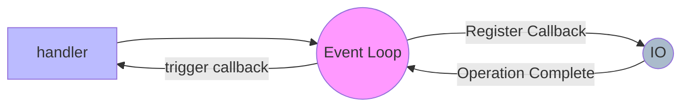

--- 
UID: 202301071423
title: "python asyncio-202301071423"
tags:
- articles
- python
- asyncio
---

# python asyncio-202301071423

# Summary

在這篇文章你會學到:

- AsyncIO 基本概念
- Awaitable: Coroutines, Tasks and Future
- AsyncIO Context Manager & Iterator

# Notes

## What is AsyncIO ?

看一下官方 Document 的解釋

> [**asyncio is a library to write concurrent code using the async/await syntax.**](https://docs.python.org/3.9/library/asyncio.html)

常見的誤區是許多剛接觸的人沒有辦法分辨出 **multithreading vs mulitprocessing vs asyncio**, 但這篇並不會詳細分析什麼情況要使用那一種 concurrency, 為了方便還是給一下基本原則:

```python
if io_bound:
    if io_very_slow:
        print("Use Asyncio")
    else:
       print("Use Threads")
else:
    print("Multi Processing")
```

那什麼是 AsyncIO ?

當CPU 執行速度比 IO 快, 為了節省 CPU 等待的浪費, 所以在 CPU 等待 IO 的過程中讓 CPU 去執行其它任務

個人最喜歡的比喻是像 [The Queen's Gambit](https://en.wikipedia.org/wiki/The_Queen%27s_Gambit_(miniseries)) 中有一段女主角一個人跟整個西洋棋社下棋的片段

主角就是運作速度極快的 CPU, 其它人則是速度比較慢的 IO. 主角並不會等待 A 下完才換跟 B 下棋. 而是一但有人移動棋子了, 她就會切換過去給出她的下一步

這樣因為 CPU 跟 IO 不等速, 節省時間而切換 CPU 的狀況就是 AsyncIO

先來張基本流程示意圖



想要了解 python asyncio, 就需要理解幾個相關詞跟概念

* **Event loop**
* **Callback**
* **Coroutines**
* **Tasks**
* **Futures**

那我們開始吧!

## Event Loop

> 西洋棋的比喻: 監聽中的對手名單

負責跑 asynchronous tasks && callbacks

Event loop 會跑在 單一 thread (main thread) 中, 就像一個 todo list 

main thread 會監聽這個 TODO List, 等待它們完成後 呼叫 Callback

## Callback

> 西洋棋的比喻: 對手(任務)

> A subroutine function which is passed as an argument to be executed at some point in the future.

關於 callback 其實在 JS 中很常見, python 中的 callback function:

```python

def func_b():
    print("func_b")

def func_a(callback, *args, **kwargs):
    print("func_a")
    callback()  # exec callback func

func_a(func_b)  # func_b is callback func_b for func_a
#  func_a
#  func_b
```

在 asyncio 中, callback 是透過 event loop schedule function 被註冊到 EventLoop

EventLoop 的 schedule functions

* [Scheduling callbacks](https://docs.python.org/3/library/asyncio-eventloop.html#scheduling-callbacks)
* [Scheduling delayed callbacks](https://docs.python.org/3/library/asyncio-eventloop.html#scheduling-delayed-callbacks)

## Awaitables

> Future-like object or a coroutine object

Python 有三個主要的 awaitable objects.

* **Coroutines**
* **Tasks**
* **Futures** .

### [Coroutines](https://docs.python.org/3.9/library/asyncio-task.html#coroutines)

Coroutine function: 可以中途 enter/exit/resumed 的 function

感覺跟 callback 很像對吧?

因為 callback 是 low-level API 中的概念(在 EventLoop 中實做). 而 Coroutines 是 high-level API. 透過 `asyncio.run` 執行

```python
import asyncio

# nested 是一個 Coroutine
async def nested():
    return 42

async def main():
    nested()  # 因為沒有 await, 所以 nested 並不會執行

    print(await nested())  # 這邊會印出 42

asyncio.run(main())
```

Python Coroutine 在 3.4 asyncio 出現之後從原本的 **Generator-based coroutines**,
多加了 **Native coroutines**

而其實 Coroutine 這個詞彙在 python 可以同時表示:

* A coroutine function： `async def` function;
* A coroutine object: an object returned by calling a coroutine function.

所以當有人說 coroutine, 在 python 內可能是

* **Native coroutines** / **Generator-based coroutines**
* **Coroutine function** / **Coroutine object**

**怎麼區分 Native coroutines && Generator-based coroutines 呢?**

1. Native coroutine 沒有 `__iter__` and `__next__` methods.
    - 不能 iterated over 
    - 不能傳給 `iter()`, `list()`, `tuple()` ...等等內建語法
    - 不支援原本的 `for ... in loop` 語法

2. Generators-based coroutines 可不可以使用 `yield from` ?
    - 不能對 Native Coroutine 使用 `yield from` -> `TypeError`
    - 透過 [@asyncio.coroutine](https://docs.python.org/3/library/asyncio-task.html#asyncio.coroutine) decorator 包裝過的 generator 對 Native coroutine 使用 `yield from`

3. inspect
    - `inspect.isgenerator()` && `inspect.isgeneratorfunction()`
        - Native coroutines return False
    - 詳細的 inspect 可以看 [doc](https://docs.python.org/3/library/inspect.html)

### Tasks

* Task 設計是為了讓 coroutines 並發執行, 調度使用的

* 一個 Event loop 同時只會跑一個 task

```python
import asyncio

async def say_after(delay, what):
    await asyncio.sleep(delay)
    print(what)

async def main():

    print("start")

    # 將 task1 && task2 註冊到 event loop 中
    task1 = asyncio.create_task(say_after(1, "hello"))
    task1 = asyncio.create_task(say_after(2, "world"))

    # 等到 兩個 task 都執行完, 大約需要兩秒(不是三秒)
    await task1
    await task2

async.run(main())
```

### [Future](https://docs.python.org/3.9/library/asyncio-future.html#asyncio.Future)

> Future objects are used to bridge low-level callback-based code with high-level async

* asynchronous operation 回傳的最終結果
* Futures 是 low-level 的 awaitable object
* 通常 application level 不會需要操作到 future

* Task && Coroutines 都是 **future-like** object
    > future-like object
    > An object with an __await__ method, or a C object with tp_as_async->am_await function, returning an iterator. Can be consumed by an await expression in a coroutine. A coroutine waiting for a Future-like object is suspended until the Future-like object's __await__ completes, and returns the result. See Await Expression for details.


## Context Manager && Iterator

### Asynchronous Context Manager

`async with`

基本的 python context manager 需要定義兩個 funcs, `__enter__` && `__exit__`.

python asynchronous context manager 則是需要定義兩個 magic method: `__aenter__` && `__aexit__`

```python
class AsyncContextManager:
    async def __aenter__(self):
        await log('entering context')
    async def __aexit__(self, exc_type, exc, tb):
        await log('exiting context')
```


### Asynchronous Iterator

`async for`

基本 Iterator 需要定義 `__iter__`, `__next__`

Async Iterator -> `__aiter__`, `__anext__`

```python
class AsyncIterable
    def __aiter__(self):
        return self
    async def __anext__(self):
        data = await self.fetch_data()
        if data:
            return data
        else:
            raise StopAsyncIteration
```

---

# Recap

如果是第一次接觸 python 的 asyncio 的人, 有可能會搞混 Tasks, 
Future, Coroutines 這些詞彙的意思.

老實說第一次接觸時也是一頭混亂. 寫這篇時也是不斷的翻 PEP 的內容.

Asyncio 的 API 變動其實滿快的. 所以詳細還是要看 doc

一個成熟的工程師除了使用工具解決問題, 其實還要了解使用的時機跟內部的實作去避免踩雷跟解釋出自己是如何解決問題的

想要研究(自虐) 的人還是把 PEP 看完會有更深的了解喔

---

# References

## PEP List

[PEP 479 -- Change StopIteration handling inside generators](https://www.python.org/dev/peps/pep-0479/)
[PEP 492](https://www.python.org/dev/peps/pep-0492/)

## Source
- https://www.youtube.com/watch?v=iG6fr81xHKA&ab_channel=PyCon2017
- https://jimmy-huang.medium.com/python-asyncio-%E5%8D%94%E7%A8%8B-%E4%BA%8C-e717018bb984
- https://blog.taiker.space/python-async-io-in-python-a-complete-walkthrough/
- http://masnun.rocks/2016/10/06/async-python-the-different-forms-of-concurrency/
